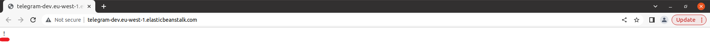

# End-to-end Telegram bot development and deployment

## Prepare Telegram
### Download Mobile Telegram application
Download [Telegram for Android](https://play.google.com/store/apps/details?id=org.telegram.messenger) or [Telegram for iPhone / iPad](https://apps.apple.com/app/telegram-messenger/id686449807).

**Note:** To download APK file directly, navigate to https://telegram.org/android and click `Download Telegram`. The `Telegram.apk` will be downloaded automatically.

### Create Telegram Account (optional)
Create new Telegram account or reuse your current/old one.

**Note:** Mobile phone number is required.

### Download Telegram Desktop
Navigate to https://desktop.telegram.org/ to download Telegram Desktop. Download and install Telegram Desktop.

### Log in to Telegram Desktop
Scan QR code from Mobile Telegram:
1. Open Mobile Telegram application on your phone.
2. Go to `Settings` > `Devices` > `Link Desktop Device`.

 

3. Scan QR code to Log In.

## BotFather
### Create a new bot with BotFather
Search for `@BotFather` Telegram bot:


Select official `@BotFather` Telegram bot and and click `START` button:


Send `/newbot` command:


Send bot name (e.g., `PyConCZBot`):


Send bot username (e.g., `PyConCZBot`). It must end with `bot`:


Copy and save the token (e.g., `5913537281:AAHebnxlMECEhExXsowa9hiHIyzqfT4kU3s`):


### Turn on inline mode
To turn on inline mode send `/mybots` command to `@BotFather` Telegram bot first:


Choose a bot from the list (e.g., `@PyConCZBot`):


Click `Bot Settings` button:


Click `Inline Mode` button:


Click `Turn on` button:


### Add inline placeholder
Click `Edit inline placeholder` button:


Send placeholder (e.g., `buy and sell prices of foreign currencies`):


Success! Inline setting updated:


## Host Telegram bot locally
### Hello world bot with pyTelegramBotAPI
Lets start with `Hello, World!` bot written on [pyTelegramBotAPI](https://github.com/eternnoir/pyTelegramBotAPI).
```sh
$ git clone https://github.com/korniichuk/telegram-pycon-cz-2023.git
$ cd telegram-pycon-cz-2023
```

Install requirements:
```sh
$ pip install -r requirements.txt
```

Create `.env` file with token:
```sh
$ touch .env
```

Copy and past token to `.env` file:
```sh
$ echo TOKEN=<TOKEN> > .env

```

Example:
```sh
$ echo TOKEN=5913537281:AAHebnxlMECEhExXsowa9hiHIyzqfT4kU3s > .env
```

Start `Hello, World!` bot:
```sh
$ python3 bot1.py
```

Navigate to your Telegram bot (e.g., `@PyConCZBot`) and click `START` button:


You can achieve the same result with `/start` command.

Stop `bot1.py` before proceeding to the next step.

### Synchronous NBP bot with pyTelegramBotAPI
To show more features of Telegram bot development, we will use [exchange rates data](https://nbp.pl/en/statistic-and-financial-reporting/rates/) provided by the central bank of the Republic of Poland (Polish: `Narodowy Bank Polski` aka `NBP`).

NBP Web API: https://api.nbp.pl/en.html

Start `bot2.py`:
```sh
$ python3 bot2.py
```
Navigate to your Telegram bot (e.g., `@PyConCZBot`) and send `/start` command.

Test `table A`, `table B`, and `table C` buttons:


Send `/a`, `/b`, and `/c` commands:


In Telegram Desktop, click the hamburger menu button ≡. Select `New Group`:


Enter Telegram `Group name` (e.g., `PyCon CZ group`). Click `Next`:


Add your Telegram bot (e.g., `@PyConCZBot`) to the group. Click `Create`.

**Note:** You can add your friend(s) to the group (optional).

Test `/start@<you_bot_username>` (e.g., `/start@pyconczbot`) command:


So, communication with Telegram bots is not always easy.
You had to send them messages in separate chats or add them to your groups.

However, with the `inline mode`, bots become omnipresent and can be used as a tool in any of your chats, groups or channels – it doesn't matter, whether the bot is a member or not.

Open chat with your friend(s) or create a new Telegram group, and type the username of your bot (e.g., `@pyconczbot`).
You can see inline placeholder now (e.g., `buy and sell prices of foreign currencies`):


Type space and `rate` command (e.g., `@pyconczbot rate`):


Select `USD`:


See result:


### Asynchronous NBP bot with pyTelegramBotAPI
```sh
$ python3 bot3.py
```

### Asynchronous NBP bot with python-telegram-bot
The following example is written on [python-telegram-bot](https://python-telegram-bot.org/).
```sh
$ python3 bot4.py
```

### Asynchronous NBP bot with aiogram
The following example is written on [aiogram](https://aiogram.dev/).
```sh
$ python3 bot5.py
```

**Note:** Parse mode `Markdown` is legacy since Telegram Bot API 4.5, retained for backward compatibility [[source]](https://core.telegram.org/bots/api#formatting-options).

## Deploy on AWS with SAM
### Install SAM
```sh
$ wget https://github.com/aws/aws-sam-cli/releases/latest/download/aws-sam-cli-linux-x86_64.zip
$ unzip aws-sam-cli-linux-x86_64.zip -d sam-installation
$ sudo ./sam-installation/install

$ sam --version
```

**Source:** https://docs.aws.amazon.com/serverless-application-model/latest/developerguide/install-sam-cli.html

### Token
Insert your token to [lambda_function.py](https://github.com/korniichuk/telegram-pycon-cz-2023/blob/main/aws-serverless-application-model/code/lambda_function.py) file. For example, from:

`TOKEN = "<TOKEN>"  # token from @BotFather for your Telegram bot`

to:

`TOKEN = "5913537281:AAHebnxlMECEhExXsowa9hiHIyzqfT4kU3s"`

### SAM build
```sh
$ cd aws-serverless-application-model
$ sam build
```

### SAM deploy
```sh
$ sam deploy --guided
```

Enter `Stack Name` (e.g., `telegram`). Enter `AWS Region` (e.g., `eu-west-1`).

```
Confirm changes before deploy [Y/n]
```
Enter `Y`.

```
Allow SAM CLI IAM role creation [Y/n]:
```
Enter `Y`.

```
Disable rollback [y/N]:
```
Enter `N`.

```
MyLambdaFunction Function Url has no authentication. Is this okay? [y/N]:
```
Enter `Y`.

```
Save arguments to configuration file [Y/n]: 
```
Enter `Y`.

Enter SAM configuration file name (e.g., `samconfig.toml`).

Enter SAM configuration environment (e.g., `default`).

```
Deploy this changeset? [y/N]:
```
Check changes and enter `Y`.

Copy and save the Lambda URL `Value` from terminal (e.g., `https://ylr4zrg2t7kega7bj7oglvzu2y0zgbni.lambda-url.eu-west-1.on.aws/`).

### Setting Telegram bot WebHook
All you have to do is to call the [setWebhook method](https://core.telegram.org/bots/api#setwebhook) in the Bot API via the following url:

`https://api.telegram.org/bot<TOKEN>/setWebhook?url=<URL>`

Where:
- `TOKEN` -- token you got from BotFather when you created your bot,
- `URL` -- Lambda URL for the MyLambdaFunction (must be HTTPS).

Example:

`https://api.telegram.org/bot5913537281:AAHebnxlMECEhExXsowa9hiHIyzqfT4kU3s/setWebhook?url=https://ylr4zrg2t7kega7bj7oglvzu2y0zgbni.lambda-url.eu-west-1.on.aws/`

`{"ok":true,"result":true,"description":"Webhook was set"}`

**Source:** https://xabaras.medium.com/setting-your-telegram-bot-webhook-the-easy-way-c7577b2d6f72

### Delete Telegram bot WebHook
To delete Telegram bot WebHook:

`https://api.telegram.org/bot{TOKEN}/setWebhook?url=`

Example:

`https://api.telegram.org/bot5913537281:AAHebnxlMECEhExXsowa9hiHIyzqfT4kU3s/setWebhook?url=`

`{"ok":true,"result":true,"description":"Webhook was deleted"}`

### SAM delete
To delete the sample application that you created, use the AWS CLI:
```sh
$ sam delete
```

## Deploy on AWS with Elastic Beanstalk
The following example is written on [pyTelegramBotAPI](https://github.com/eternnoir/pyTelegramBotAPI).
See aiogram example: https://stackoverflow.com/a/64911415

### AWS CLI
Install AWS CLI:
```sh
$ curl "https://awscli.amazonaws.com/awscli-exe-linux-x86_64.zip" -o "awscliv2.zip"
$ unzip awscliv2.zip
$ sudo ./aws/install

$ aws --version
```

**Source:** https://docs.aws.amazon.com/cli/latest/userguide/getting-started-install.html#getting-started-install-instructions

### EB CLI
Install EB CLI:
```sh
$ pip install awsebcli

$ eb --version
```

**Source:** https://docs.aws.amazon.com/elasticbeanstalk/latest/dg/eb-cli3-install-advanced.html

### EB init
Navigate to `aws-elastic-beanstalk` folder and initialize the directory with the EB CLI:

```sh
$ cd aws-elastic-beanstalk
$ eb init
```

Select a default region (e.g., `eu-west-1`). Enter a new application name for your Elastic Beanstalk application (e.g., `telegram`).

```
It appears you are using Python. Is this correct?
(Y/n):
```
Enter `Y`.

Select a platform branch (e.g., `Python 3.8 running on 64bit Amazon Linux 2`). Details: https://docs.aws.amazon.com/elasticbeanstalk/latest/platforms/platforms-supported.html#platforms-supported.python

```
Do you want to set up SSH for your instances?
(Y/n):
```
Enter `Y`.

### EB create
Create a new Elastic Beanstalk environment:
```sh
$ eb create
```

Enter Environment Name (e.g., `telegram-dev`).
Enter DNS CNAME prefix (e.g., `telegram-dev`).
Select a load balancer type (e.g., `application`).

```
Would you like to enable Spot Fleet requests for this environment? (y/N):
```
Enter `N`.

### EB setenv
To set Telegram token as an environment variable in the EB CLI, run the following command:
```sh
$ eb setenv TOKEN=<TOKEN>
```

Example:
```sh
$ eb setenv TOKEN=5913537281:AAHebnxlMECEhExXsowa9hiHIyzqfT4kU3s
```

**Source:** https://repost.aws/knowledge-center/elastic-beanstalk-pass-variables

### EB deploy
To deploy new source code to the environment:
```sh
$ eb deploy
```

### EB open
Open the EB application URL in a browser:
```sh
$ eb open
```

If you can see exclamation mark, Telegram bot deployed successfully:



### Domain name
**This part is out of workshop scope!**
We need to purchase and configure a custom domain name (e.g., `telegrambot.click` for 3 USD) for our Elastic Beanstalk environment.

### SSL certificate
**This part is out of workshop scope!**
We need use HTTPS to allow secure connection.

To set up SSL we need to obtain SSL certificate:
1. Navigate to AWS Certificate Manager (ACM).
2. Click `Request certificate` link or `Request` button. Select `Request a public certificate`. Click `Next`.
3. Add two domain names: one for website (e.g., `korniichuk.click`) and one wildcard domain (e.g., `*.korniichuk.click`). It will cover all subdomains including www or any other.
4. Select `DNS validation` and click `Request` button.

Because we delegated domain management to AWS, we need to validate ownership by expanding any domain and clicking `Create records in Route 53`.

SSL certificate will be issued after a while (it can take up to 48 hours - usually within 30 minutes after nameservers delegation is completed).

**Source:** https://dev.to/bnn1/deploying-dockerized-nextjs-app-to-aws-eb-part-3-setting-custom-domain-45bm

### Add listener
**This part is out of workshop scope!**
1. Open the [Elastic Beanstalk console](https://console.aws.amazon.com/elasticbeanstalk), and in the Regions list, select your AWS Region (e.g., `eu-west-1`).
2. In the navigation pane, choose `Environments`, and then choose the name of your environment from the list (e.g., `telegram-dev`).
3. In the navigation pane, choose `Configuration`.
4. In the `Load balancer` configuration category, choose `Edit`. Note: If the Load balancer configuration category doesn't have an `Edit` button, your environment doesn't have a load balancer.
5. On the `Modify Application Load Balancer` page, choose `Add listener`.
6. For `Port`, type the incoming traffic `443` port.
7. For `Protocol`, choose `HTTPS`.
8. For `SSL certificate`, choose your certificate. Choose `Add`. Scroll down and click `Apply`

**Important:** Adding listener this way (via [Elastic Beanstalk](https://console.aws.amazon.com/elasticbeanstalk)) will fix security group automatically. For adding listener via EC2 you need to fix security group manually.

**Source:** https://docs.aws.amazon.com/elasticbeanstalk/latest/dg/configuring-https-elb.html

### Add DNS record
**This part is out of workshop scope!**


### EB terminate
To delete bot from AWS cloud, terminate the environment:
```ssh
$ eb terminate
```

## Extra sources
1. [Long polling vs Webhooks](https://grammy.dev/guide/deployment-types.html)
2. [Sample Python Telegram bot AWS serverless](https://github.com/jojo786/Sample-Python-Telegram-Bot-AWS-Serverless)
3. [Error code: 429. Description: Too Many Requests](https://github.com/eternnoir/pyTelegramBotAPI/issues/253)
